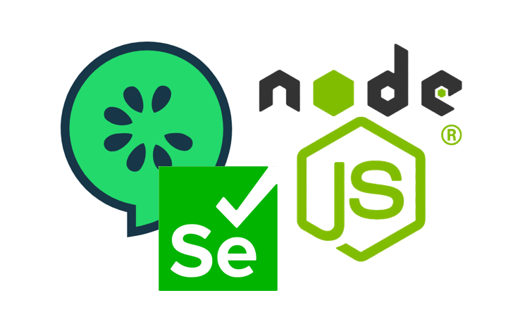

# Cucumber/Selenium/JavaScript Demo and Intro Training



Welcome to the Cucumber/Selenium/JavaScript Demo and Intro Training repository! This guide will help you get started with the project and provide you with instructions on how to set up and use the demo. 

## Prerequisites

Before you begin, make sure you have the following installed on your local machine:

- **Node.js**: Ensure you have Node.js installed. You can download it from [nodejs.org](https://nodejs.org/).

> [!NOTE]
> Node.js is a cross-platform, open-source JavaScript runtime environment that can run on Windows, Linux, Unix, macOS, and more. Node.js runs on the V8 JavaScript engine, and executes JavaScript code outside a web browser. Node.js lets developers use JavaScript to write command line tools and for server-side scripting.

- **Git**: Git is required for cloning the project. Install Git from [git-scm.com](https://git-scm.com/).

> [!NOTE]
> Git is a distributed version control system that tracks versions of files. It is often used to control source code by programmers who are developing software collaboratively.

- **Visual Studio Code (VSCode)**: A popular code editor. Download it from [code.visualstudio.com](https://code.visualstudio.com/).

- **GitHub Account**: A GitHub account is required to clone the repository and manage your project. You can sign up for a free account at [github.com](https://github.com/).

> [!NOTE]
> GitHub is a developer platform that allows developers to create, store, manage and share their code. It uses Git software, providing the distributed version control of Git plus access control, bug tracking, software feature requests, task management, continuous integration, and wikis for every project.

## Complete git/GitHub Intro (optional)
> [!NOTE]
The basic training materials on git/GitHub can be found in `GIT-GITHUB.md`. Open this file to get started with Git/GitHub Introduction if required.

## Clone the Project

1. Open your terminal (Command Prompt, PowerShell, or any terminal of your choice).
2. Clone the repository to your local machine using the following command:

   ```bash
   git clone [replace with this repo location]
   ```
   If prompted if you trust the author, select 'Yes, I trust the author' button in VSCode

3. Navigate into the project directory:

   ```bash
   cd [replace with your folder location on your pc]
   ```

## Install Dependencies

1. Install the project dependencies using npm:

   ```bash
   npm install
   ```

   This command will read the `package.json` file and install all required packages, including Cucumber and Selenium.


## Complete Selenium/Cucumber Intro Training
> [!NOTE]
The training materials are stored in `INTRO.md`. Open this file to get started with the introductory tutorial.Follow the instructions in `INTRO.md` to complete the intro tutorial. This will guide you through the basics of using Cucumber and Selenium with JavaScript.

## Create a New Project

1. **Select a Web App**: Choose a web application you want to automate. This could be an internal tool, a sample app, or any other web-based application.

   - **[Parabank](https://parabank.parasoft.com/parabank/index.htm)**: A sample banking application for testing purposes.
   - **[Sauce Labs Demo App](https://www.saucedemo.com/)**: An e-Commerse demo app for testing various web automation scenarios.
   - **[Demo Orange HRM](https://opensource-demo.orangehrmlive.com/web/index.php/auth/login)**: HRM site for practicing automation.
   - **[Demo Shopping Cart App](https://shopping-cart-new-one.vercel.app/)** Can also be installed locally via this **[MERN eCommerce Shopping Cart GitHub Repo](https://github.com/Ajith101/shopping-cart)**
   - Other Apps of your choice with business logic and multiple test cases you can automate


2. **Create a New Project**: Based on what you learned in the intro tutorial, create a new project for automating your selected web app. You may start by setting up a new directory and initializing it with `npm`.

3. **Create a Test Plan and Test Cases**: Develop a test plan outlining the features and scenarios you want to automate. Write test cases based on this plan.

4. **Start Creating Your QA Automation Framework**: Set up your QA automation framework using Cucumber and Selenium. Create feature files, step definitions, and any necessary configuration files. Implement the automation of your test cases according to your test plan.

5. **Automate Your Test Cases**: Begin automating the test cases you defined. Run your tests to ensure they work correctly and refine them as needed.

## Conclusion

You are now ready to start working on your QA automation project using Cucumber and Selenium with JavaScript. If you encounter any issues or have questions, refer to the documentation or seek help from the community.

Happy learning!

---
.